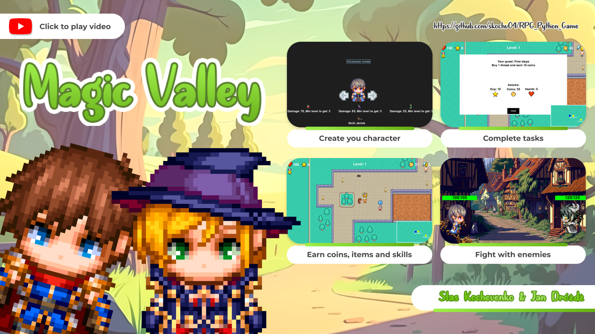

# 🧙‍♂️ Magic Valley

A Python-based RPG game, developed as part of the 4th semester of studies at AGH.

## 👥 Team Members:
- **Stas Kochevenko** | skochv04@gmail.com  
- **Jan Dróżdż**

## 🎮 Game Overview:
Magic Valley is a **2D RPG game** featuring:  
✅ Dynamic battles ⚔️  
✅ Quest completion 📜  
✅ In-game shop 🛒  
✅ Interactive world 🌍  

Built with **Python** and **Pygame**, it provides an engaging role-playing experience.

## 🛠️ Technologies Used:
- **Programming Language**: Python 🐍  
- **Game Engine**: Pygame 🎮  
   
[](https://www.youtube.com/watch?v=M2kYhqqz4nw)

## 🚀 How to Run the Game?

### 1️⃣ Install dependencies
```bash
pip install -r requirements.txt
```

### 2️⃣ Run the game
```bash
python main.py
```
